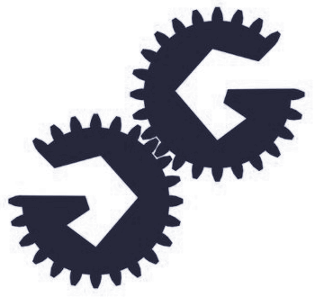

<table style="border: none !important;" ><tr style="border: none;"><td style="border: none;">

</td><td style="border: none;">
        <h3 class="text-center mr-5" style="text-align: center; line-height: 1;">
        	

            
<strong>Hacking USB on the Cheap with USB-Tools</strong> 
            <small>with <a href="https://twitter.com/ktemkin">Kate Temkin</a>, <a href="https://twitter.com/Qyriad">Mikaela Szekely</a>, <a href="https://greatscottgadgets.com">Great Scott Gadgets</a>, and Friends</small>
 
            
<small><small><b>Current iteration:</b> <a href="https://mini.usbc.tf">See CTF System</a></small></small> 
            

        </h3>
</td></tr></table>
 

<strong>Getting Started & Materials</strong>

<ul>
<li> <a href="pages/environment">Environment setup: setting up your machine to hack USB -- and run the exercises</a></li>
<li> <a href="pages/flashing">Quick guide: flashing your target ('victim') boards</a></li>
<li> <a href="challenges">Workshop Exercises and Mini-CTF Challenges</a></li>
</ul>

<strong>Workshop Materials</strong>  Differing events and timeslots mean we won't always make it through this list, but here's a rough order:

<ul>
<li> <a href="front_matter_bsides.pdf">1: Slides: Introduction</a></li>
<li> <a href="environment">2: Tutorial: Setting Up Your Environment</a></li>
<li> 3: Demo: $4 USB Analysis with Sigrok & PulseView </li>
<li> <a href="control_requests.pdf">4: Slides: USB Control Requests: a firmware-ish view</a></li>
<li> <a href="explore-usb-example.py">5: Demo: Asking Devices to Describe Themselves </a></li>
<li> <a href="challenges">6: Exercise 1: Exploring Vendor Requests</a></li>
<li> 7: Demos: A single solution to Excercise 1 and some more techniques.</li>
<li> <a href="challenges">8: Exercise 2: Mis-using USB</a></li>
<li> 9: Demos: Demo buffet! As many cool things as we can show you in the time left.</li>
</ul>

<strong>Reference</strong>

<ul>
<li> <a href="http://www.beyondlogic.org/usbnutshell/">BeyondLogic's USB in a Nutshell</a></li>
<li> <a href="usb_20_spec.pdf">USB 2.0 Specification</a>
	<ul>
    <li><a href="usb_device_framework_chapter.pdf">Chapter 9 (USB Device Framework) by itself, for your convenience</a></li>
        <li><a href="https://www.usb.org/documents">USB Document Search (can easily find classes+addenda)</a></li>
    </ul>
</li>
</ul>

<strong>Hardware and Software Tools</strong>

<ul>
<li> <a href="https://greatscottgadgets.com/greatfet/one/">GreatFET One/Azalea</a></li>
<li> <a href="https://github.com/usb-tools">USB Tools Repository</a></li>
<li> <a href="https://github.com/usb-tools/viewsb">ViewSB USB Analyzer</a></li>
<li> <a href="https://github.com/usb-tools/facedancer">FaceDancer</a></li>
<li> <a href="https://sigrok.org">Sigrok: Logic Analyzer Software</a></li>
</ul>

