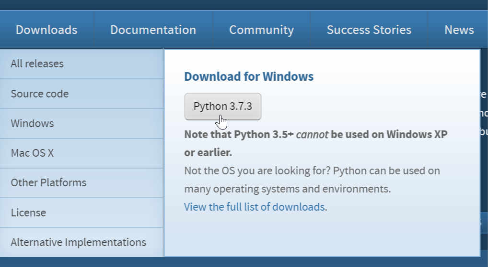

<br />

# Setting up the Environment

For this workshop you'll need three things: Python, libusb, and PyUSB.

## Linux

#### Debian/Ubuntu/Kali
Install packages for libusb and PyUSB; for example: 
```
$ apt install libusb-dev python python-usb
```

Then install [udev rules](50-usb-workshop.rules) so we can access the board without root.
```
$ sudo cp 50-usb-workshop.rules /etc/udev/rules.d/
$ sudo udevadm control --reload
```

## Mac

For now, Mac computers come with python-- so you'll only need to explicitly pull down libusb. This is easiest with [Homebrew](https://brew.sh); though equivalent procedures exist for other projects (e.g. MacPorts).

Assuming you're doing things our way:
1. Set up [Homebrew](https://brew.sh) by following their instructions.
2. Install libusb by running the following command:

```
brew install libusb
```

You're all set to move on to the next tutorial!

## Windows

#### Installing Python

1. Head over to https://www.python.org in your favorite web browser.
2. Under the Downloads menu, click the 'Python 3.7.3' button, and save the Python installer.
	
3. Run the installer
4. Click "Add Python 3.7 to PATH", then "Install Now".
   <br/>

#### Installing PyUSB

1. Open a command prompt or PowerShell (searching each in the Windows start menu should yield the respective program).
2. Install PyUSB with
	```
    $ pip install pyusb
    ```

### Installing the libusb driver for the ATtiny board

1. Download [Zadig](https://zadig.akeo.ie).
2. Run Zadig.
3. Plug in your ATtiny board to a free USB port. 
4. The device *should* show up in Zadig as "Unknown Device #1" or similar. Select that device.
5. Use the arrows to select `libusb-win32`, and click "Install Driver".
   <br/>

After you [program the board](flashing) you'll have to repeat steps 2-5 again.


