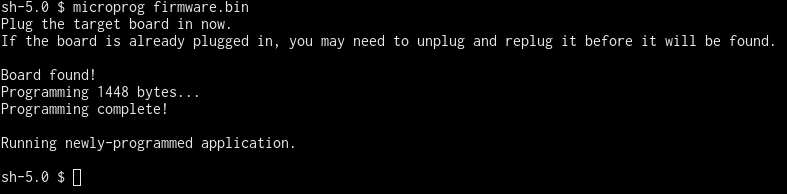

<br />

# Flashing the Boards

### All Platforms

First, install the Python Firmware Uploader with pip:
```
$ pip install pyfwup
```
Linux and macOS may require either `pip install --user`, or `sudo`.

Challenges with generally have a firmware `.bin` file to be flashed to the device. To flash a firmware file, start with the device unplugged, then use the following command:

```
$ microprog <bin_filename>
```

The program will prompt for you to plug the device into your USB port. Plug your device in, wait for flashing to complete, and you're done!



### Windows

On Windows the process has an extra step for ***only*** the first time. After flashing the board, you'll need to use Zadig to install `libusb-win32` for the programmed device again. Steps 2-5 in [Setting up the Environment](environment) describe this process, though Zadig may report a name other than "Unknown Device #1".

<!-- Once the first exercise is developed, I'll put a screenshot of Zadig with that firmware file—since what shows up in Zadig is the String Descriptor for iProduct -->
